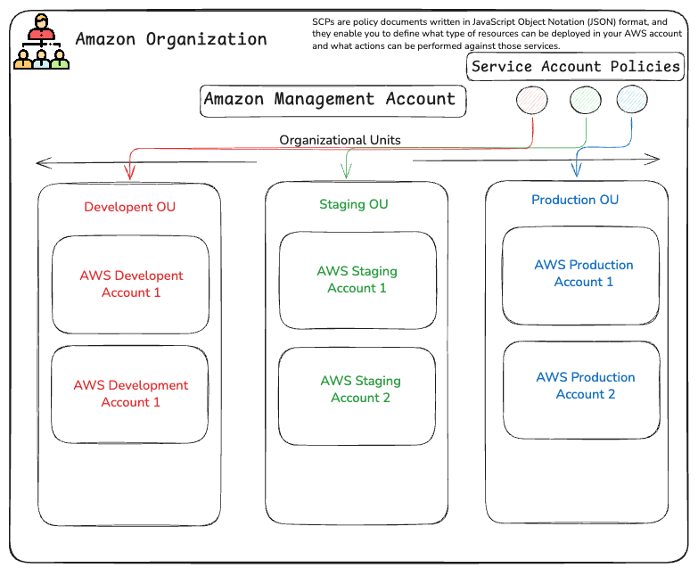

## AWS Accounts and Global InfraStructure
AWS regions are physical locations across the globe where AWS hosts its infrastructure facilities. These comprise data centers designed to enable customers to access a vast collection of infrastructure services with which they can deploy cloud resources, such as compute, network, storage, and database services. Customers can connect to a given region anywhere across the Global Infrastructure.

### Regions and Zones
The primary purpose of having multiple AZs in each region is to enable customers to host their applications and workloads in a manner that offers high availability, fault tolerance, and scalability. With multiple AZs, you can host copies or replica application resources across these AZs, which ultimately means that you can continue to serve your customers even if there is an outage of one AZ in the given region.

This is all possible because, although each AZ operates independently, they are still connected over high-speed, high-bandwidth, low network latency, and fully redundant, dedicated metro fiber connectivity.

### Service Control Policies 
When you create an AWS Organization, Service Control Policies (SCPs) are disabled by default.When you enable SCPs, AWS automatically provides a default policy called FullAWSAccess.FullAWSAccess is attached to the organization root.Because SCPs are inherited, it applies to the OUs and accounts underneath the root.

  

**Note** : We can also apply policy at the account level.

If you detach the FullAWSAccess policy from a specific OU or account, you must ensure that you replace it with a policy that specifies the services you want to access and the actions you wish to perform. Otherwise, you cannot perform any actions in the account.

### AWS Landing Zone

Imagine an organization with:

AWS Organization
│
├── Production Account
├── Development Account
├── Security Account
├── Logging Account
├── Networking Account
└── Audit Account

Setting all of these up consistently by hand becomes difficult. **AWS Landing Zone** provides a blueprint/foundation for setting up this multi-account environment according to AWS best practices.These blueprints will help design and architect a multi-account deployment, offering IAM, governance, data security, and audit logging capabilities.

### AWS Control Tower

To help automate the deployment of multiple accounts using these recommended blueprints, AWS offers a service known as AWS Control Tower. This service can automatically implement your landing zone to include the following: