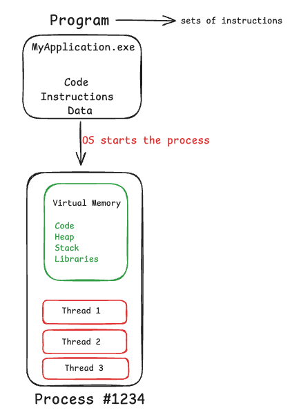

## Fundamentals 
Fundamentals of Java for the strong foundations in the Java concurrency and other 

## Question Bank 
The follwing section will be in the form of questions and answers.

#### Questions 1 : What is Thread in java ?
A Thread in Java is the smallest unit of execution within a program. It is an independent path of execution that allows a Java application to perform multiple tasks concurrently (multithreading).

Every Java program starts with at least one thread: the main thread, which executes the public static void main() method.

#### Questions 2 : Difference between a process and a thread?
The fundamental difference between a Process and a Thread lies in memory isolation and resource ownership.

A process represents an independent executing program with its own private memory, while a thread is a smaller execution unit inside a process that shares memory with sibling threads.

<p align="center">
  
</p>

#### Questions 3 : Difference between start() and run()?
start() creates a new thread of execution, while run() executes code synchronously within the existing thread.
```
public class ThreadStartVsRun {
    public static void main(String[] args) {
        Thread t1 = new Thread(() -> {
            System.out.println("Executing inside: " + Thread.currentThread().getName());
        }, "MyCustomThread");

        // 1. Calling run() directly
        // Prints: Executing inside: main
        t1.run(); 

        // 2. Calling start()
        // Prints: Executing inside: MyCustomThread
        t1.start(); 
    }
}
```

#### Good for Mental Modal 
In Java, the child thread (also called a worker or background thread) is any thread spawned and started by another existing thread. The thread that creates and starts it is called the parent thread (which is usually the main thread).

```
public class ThreadStatesDemo {
    // PARENT THREAD (the "main" thread starts execution here)
    public static void main(String[] args) throws InterruptedException {

        // 1. Instantiating the CHILD THREAD
        Thread thread = new Thread(() -> {
            // ---> CHILD THREAD CALL STACK STARTS HERE <---
            try {
                Thread.sleep(400); 
            } catch (InterruptedException e) {
                e.printStackTrace();
            }
        });

        // Parent starts the child thread
        thread.start(); 

        // Parent queries child's state
        System.out.println("Child state: " + thread.getState()); 

        // Parent pauses itself to wait for child to finish
        thread.join(); 
    }
}
```

#### Questions 4 : What are the Java thread states?
In Java, a thread goes through 6 distinct states during its lifecycle, as defined by the Thread.State enum:

```
public class Main {
    public static void main(String[] args) throws InterruptedException {
        Thread thread = new Thread(() -> {
            try {
                // Transitions to TIMED_WAITING
                Thread.sleep(400); 
                System.out.println("Inside the thread!");
            } catch (InterruptedException e) {
                e.printStackTrace();
            }
        });

        // 1. NEW
        System.out.println("State after creation: " + thread.getState()); 

        // 2. RUNNABLE
        thread.start();
        System.out.println("State right after start(): " + thread.getState());

        // Wait briefly so the child thread enters sleep
        Thread.sleep(100);

        // 3. TIMED_WAITING
        System.out.println("State while sleeping: " + thread.getState());

        // Wait for child thread to finish
        thread.join();

        // 4. TERMINATED
        System.out.println("State after completion: " + thread.getState());
    }
}
```

#### Questions 5 : What happens when a thread calls sleep()?
```
Suppose if in the parent Thread we have Thread.sleep(5)
```
In Java, Thread.sleep(500) pauses the execution of the currently running thread for exactly 500 milliseconds (half a second). We will cover this more in upcoming sections.

#### Questions 6 : What does Thread.interrupt() actually do?
Thread.interrupt() does not forcefully stop or kill a running thread. Instead, it sets a boolean flag (the interrupted status) on the target thread, acting as a polite signal requesting the thread to stop what it is doing.

==Case 1 : If the thread is in a blocking call==
Thread.sleep(), Object.wait(), Thread.join(), etc.
- It immediately throws an InterruptedException.
- The interrupted status flag is automatically cleared back to false.
- The thread wakes up from the blocked state and enters its catch block.

```
Thread t = new Thread(() -> {
    try {
        Thread.sleep(5000); // Sleeping
    } catch (InterruptedException e) {
        System.out.println("Interrupted while sleeping! Exiting safely...");
    }
});
t.start();
t.interrupt(); // Wakes up 't' immediately by throwing InterruptedException
```

==Case 2 : If the Thread is Actively Running CPU Code==
If the thread is executing normal loops or logic, calling interrupt() has no immediate effect unless the thread manually checks its own flag:
- The internal interrupted flag is set to true.
- The thread continues running uninterrupted until it explicitly checks isInterrupted() or Thread.interrupted().

```
Thread worker = new Thread(() -> {
    while (!Thread.currentThread().isInterrupted()) {
        // Keep doing work until another thread calls worker.interrupt()
    }
    System.out.println("Cleaned up and stopping worker thread.");
});
worker.start();
// ... later ...
worker.interrupt(); // Sets flag to true, loop terminates on next check
```
Illutrated Example : [Click](ThreadOrchestrationWithInterrupt.java)