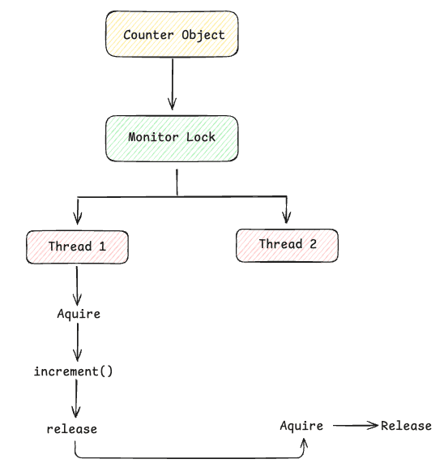

## Synchronization
In Java, synchronization is a mechanism used to control access to shared resources when multiple threads execute concurrently.The main goal is to prevent race conditions and maintain data consistency.

Suppose we have Counter object and two Thread wants to increment the variable at the same time, so it might happens both enter into the same race conditions.

```
class Counter {
    int count = 0;

    void increment() {
        count++;
    }
}
```

so in order to avoid that we can use the synchronized blocks, methods or at the class level. As of now just take a note that this will prevent multiple threads to get into the race conditions.

```
public void increment() {
    synchronized (this) {
        count++;
    }
}
```

#### 1. How does synchronized work?
Suppose we have the Counter object. 

```
class Counter {
    private int count = 0;

    public synchronized void increment() {
        count++;
    }
}
```
Here Java associates the Monitor with the object. The synchronized will provide the following two mechanisms : 
- Mutual exclusion : Only one thread can own the same monitor at a time.
- Memory visibility : Synchronization also establishes a happens-before relationship. When Thread A releases the monitor  after and Thread B subsequently acquires the same monitor, Thread B is guaranteed to see the write.

**Key is : Only one thread can hold this particular monitor at a time.**

<p align="center">
  
</p>

#### 2. What is an intrinsic monitor?
An intrinsic monitor is the built-in locking mechanism associated with every Java object. It is what Java uses behind the scenes when you use synchronized. It is called "intrinsic" because the monitor is intrinsic to the object we don't explicitly create it : 
```
Monitor monitor = new Monitor();
```
For an instance synchronized method, the monitor is this, associated with the instance, but if we use the static one that it will be associated with the class.

```
public synchronized void withdraw() {
    // ...
}
```
```
public static synchronized void foo() {
}
```

#### 3.Can two synchronized methods execute simultaneously?
It depends on the Monitor they lock. If they have same monitor both method cannot be executed at the same time.

**CASE 1 : Same object → Cannot execute simultaneously**
```
class Account {

    public synchronized void withdraw() {
        // ...
    }

    public synchronized void deposit() {
        // ...
    }
}
```
because for the same instance let's say : 
```
Account account = new Account();
```
both methods lock the same monitor and therefore, if Thread 1 is executing withdraw() Thread 2 cannot execute deposit() on the same account.

**CASE 2: Different objects → Can execute simultaneously**
If we have something like : 
```
Account account1 = new Account();
Account account2 = new Account();
```
In this we have different monitors for the different instances therefore we can execute both at the same time.

#### 3. What happens when a thread tries to acquire an already-held monitor?
When a thread tries to acquire a monitor that another thread already holds, it blocks and waits until the monitor becomes available. As being described in the above diagram.

#### 4. Can a synchronized method call another synchronized method?
Yes. A synchronized method can call another synchronized method.The important part is that Java's intrinsic monitor is reentrant.
Key takeaway : Java's intrinsic monitors are reentrant.In Java, intrinsic monitors (the locking mechanism behind the synchronized keyword) are reentrant. This means if a thread already holds a lock on an object, it can acquire the exact same lock again without blocking itself.

#### 5. What is lock contention?
Lock contention occurs when multiple threads compete for the same lock/monitor, causing some threads to wait while another thread holds it.Now imagine 100 threads calling, the waiting caused by this competition is **lock contention**.
As contention increases, you can see:

- Increased latency
- Reduced throughput
- More context switching
- Threads spending more time blocked
- Poor CPU utilization in some workloads

#### 6.What are the performance implications of excessive synchronization?
Excessive synchronization can become a performance bottleneck because it limits how much work your threads can execute concurrently.
1. Reduced concurrency
2. Lock contention
3. Context switching overhead
4. Throughput decreases


#### 7. You have a service where 500 threads are frequently blocked on the same synchronized method. How would you diagnose and redesign it?
Start with thread dumps.
Take several thread dumps a few seconds apart: ``` jcmd <PID> Thread.print ```
and check whether they are all waiting on the same monitor/object.You might see:
```
"worker-101" BLOCKED
    - waiting to lock <0x000000076abc123>

"worker-102" BLOCKED
    - waiting to lock <0x000000076abc123>

"worker-103" BLOCKED
    - waiting to lock <0x000000076abc123>
```
That <0x...> is the important clue: many threads are competing for the same monitor.